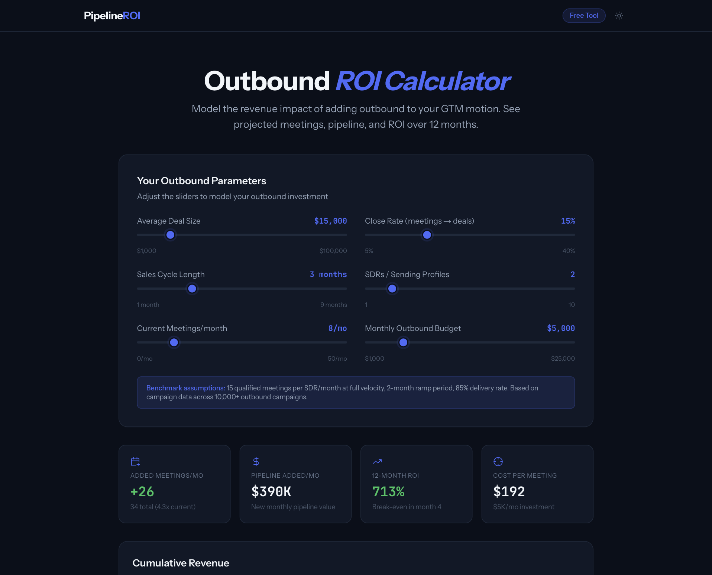

# Outbound ROI Calculator

Free interactive tool that models the revenue impact of adding outbound to your GTM motion. Input your deal size, close rate, sales cycle, and budget — get instant 12-month projections for pipeline, meetings, and ROI.

### [Live Demo](https://outbound-roi-calculator-six.vercel.app)



## Features

- **6 configurable inputs** — deal size, close rate, sales cycle, SDR count, current meetings, monthly budget
- **Real-time projections** — instant 12-month revenue, pipeline, and meeting calculations with ramp-up modeling
- **Interactive charts** — cumulative revenue area chart and monthly meetings bar chart (Recharts)
- **Month-by-month breakdown** — detailed table with color-coded net ROI
- **Dark/light theme** — toggle between themes with smooth transitions
- **Fully client-side** — zero API calls, all computation runs in the browser

## Tech Stack

- **Next.js 14** (App Router)
- **TypeScript** (strict mode)
- **Tailwind CSS v3**
- **Recharts** for data visualization
- **Lucide React** for icons
- **PostHog** for analytics
- **Vercel Analytics**

## Getting Started

```bash
npm install
npm run dev
```

Open [http://localhost:3000](http://localhost:3000) to view it.

## Deploy

[](https://vercel.com/new/clone?repository-url=https://github.com/NoaTubic/outbound-roi-calculator)
